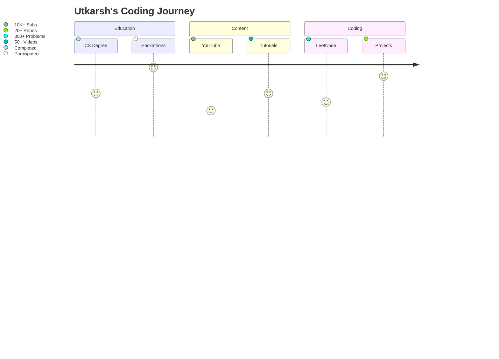

# 🎇 **HELLO WORLD, I'M UTKARSH GUPTA** 🎇  
**✨ Creator of @codewithuv • Full Stack Sorcerer • Tech Content Wizard ✨**  

  
   
  

---

## 🌌 **UTKARSH'S CODING UNIVERSE**  

  
  <!-- YouTube Channel -->
 <!-- -->
  
  <!-- GitHub Stats -->
 <!-- -->
  
  <!-- LeetCode Stats -->
  
  
  

---

## 🎥 **CODEWITHUV HIGHLIGHTS**  

  
   
  
  <h3>Join  coders in our learning journey!</h3>

---

## 🛠 **TECH STACK**  

  
   
  

---

## 🏆 **ACHIEVEMENTS**  

---

## 📡 **CONNECT WITH UV**  

  <!-- Animated Contact Badges -->
 <!-- -->
  
  
  
   
  
  <h2>Let's build the future of tech together!</h2>

---

  
  
⭐ Star my repos if you find them useful! ⭐

  

**Keep coding, keep creating!** 🚀🔥
